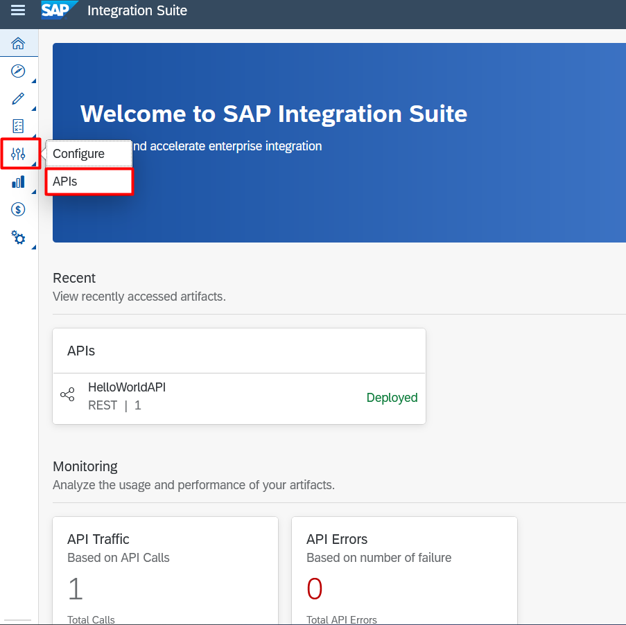
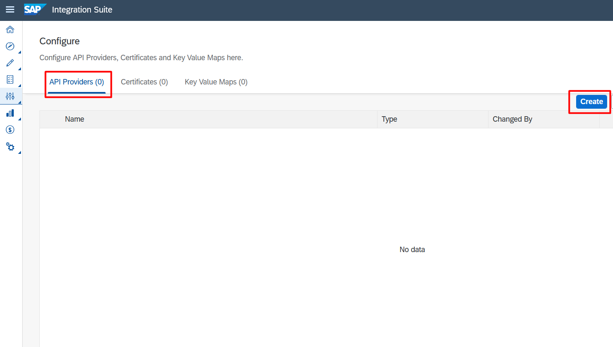
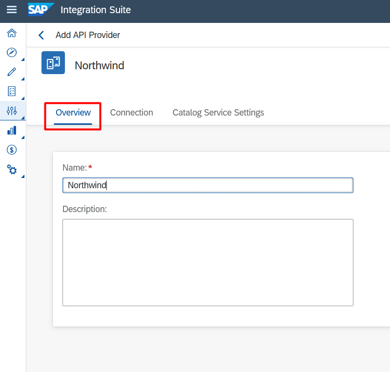
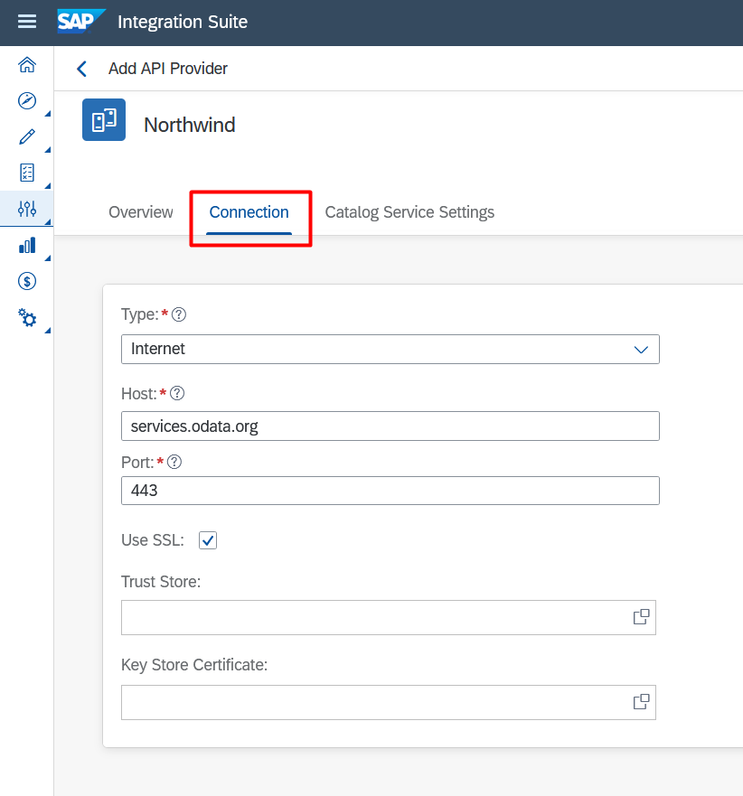
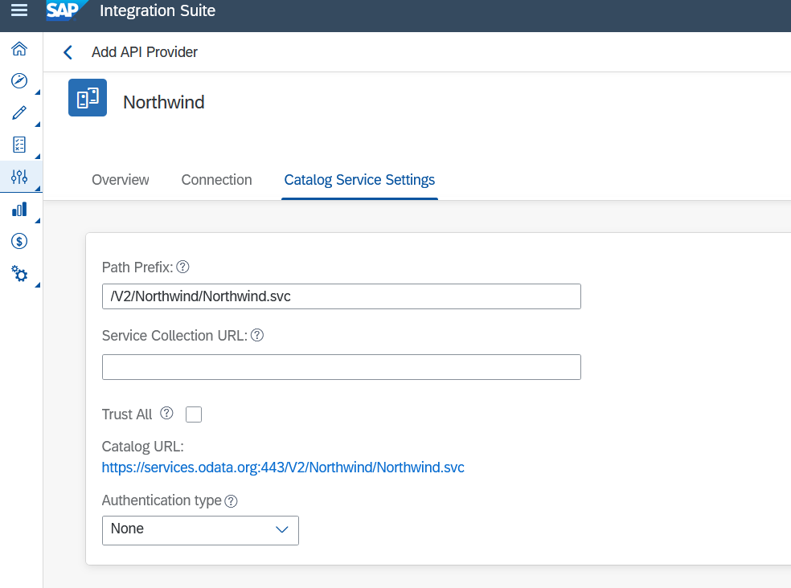
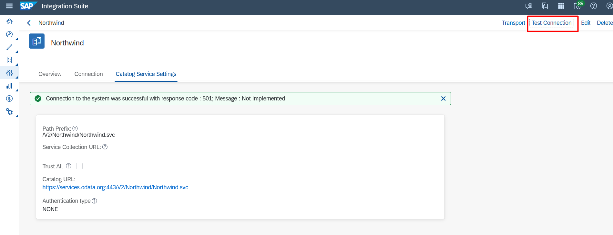

# Exercício 1 - Criar um Proxy Provider

Neste exercício você ira criar um provider para consumir uma API.

### 1.1 - Acessar área de API Provider

1. Acesse a página "Configure APIs"

    

2. Create

    Nesta página é onde será exibido todos os Providers criados. Clique no botão "Create".

    

### 1.2 - Configurando Provider

1. Criando Provider com o Northwind.

Northwind é um serviço OData criada pela Microsoft para fins de treinamento e demonstração de tecnologias, como o acesso a dados via OData.

**Informações:**

- **Nome:** Northwind
- **Type:** Internet
- **Host:** services.odata.org
- **Port:** 443
- **Use SSL:** Sim
- **Path Prefix:** /V2/Northwind/Northwind.svc/

2. Aba **Overview**

    

3. Aba **Connection**

    

4. Aba Catalog Service Settings

    

### 1.3 - Testando Provider

1. Após preencher os campos necessários, clique em **save** e depois em **Test Connection**

    

