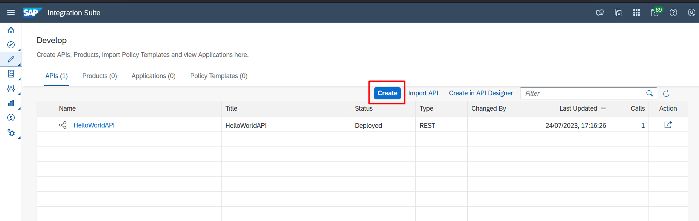

# Exercício 2 - Criando uma API Proxy

Neste exercício você ira criar e fazer o deploy de uma API Proxy.

### 1.1 - Acessar área de API Proxy

1. Acesse a página "Design Artifacts"

    

2. Create

    Nesta página é onde será exibido todas as APIs do ambiente. Clique no botão "Create".

    

### 1.2 - Configurando uma API Proxy

1. Criando uma Proxy API consumindo o Provider Northwind criando anteriormente

    

**Informações:**

- **API Provider:** Northwind
- **URL:** /V2/Northwind/Northwind.svc
- **Name:** Northwind
- **Title:** Northwind API
- **API State:** Active
- **API Base Path:** /northwind
- **Version:** v1
- **Service Type:** ODATA

### 1.3 - Salvando e fazendo o deploy

1. Clique em "Save"

    

2. Clique em deploy

    

    Nesta página é onde será exibido todos os Providers criados. Clique no botão "Create".

    

    
