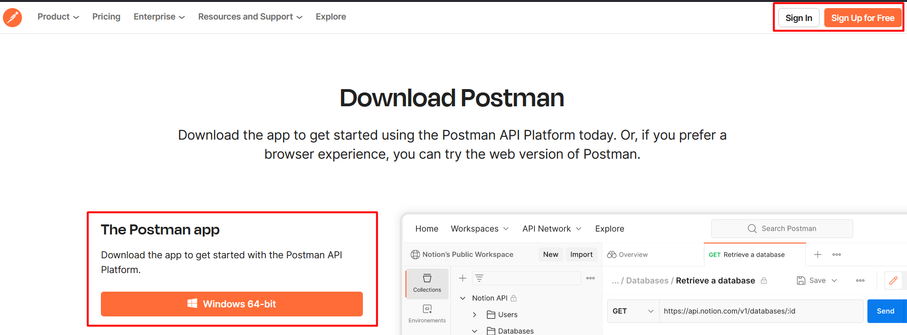
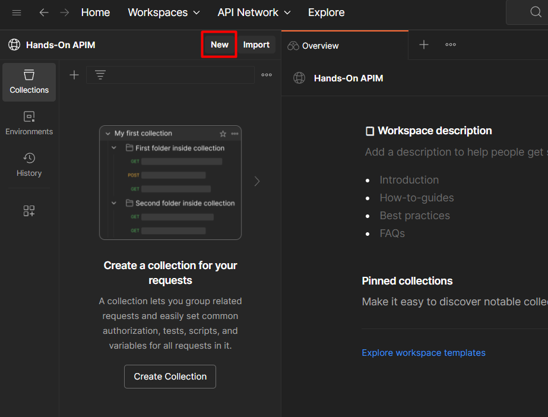
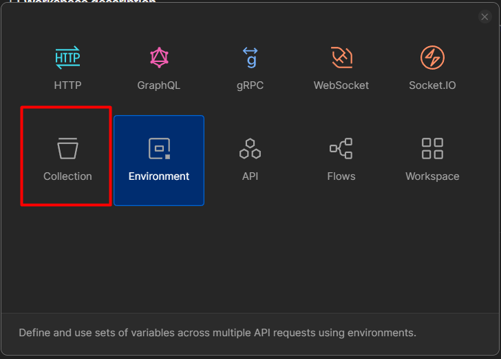
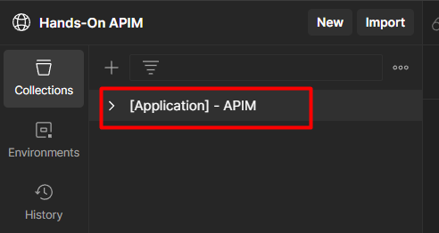
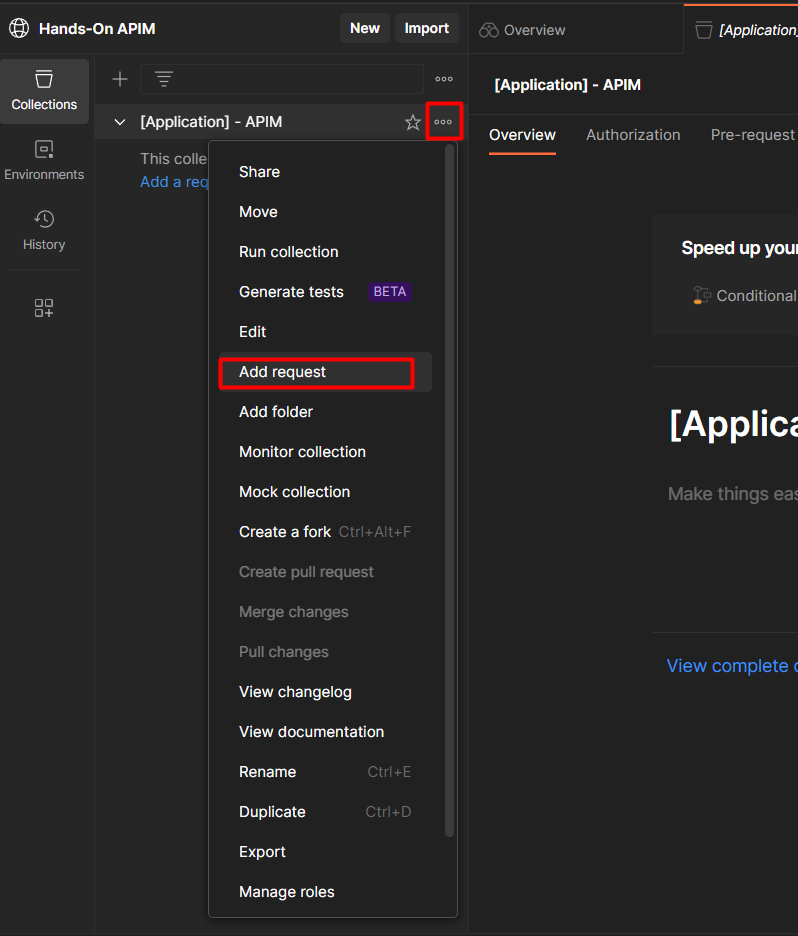
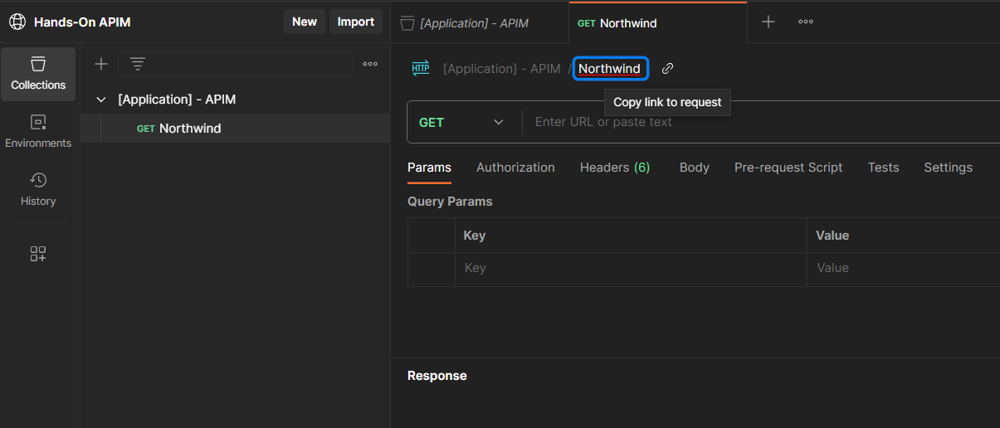
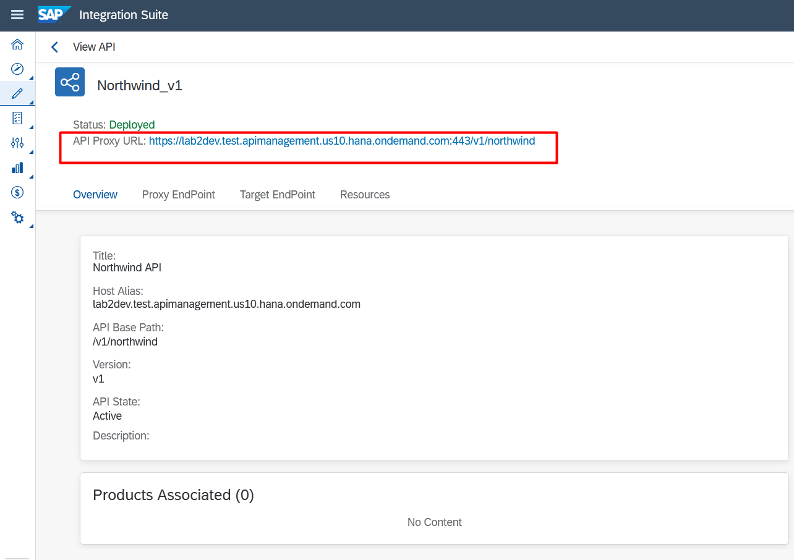
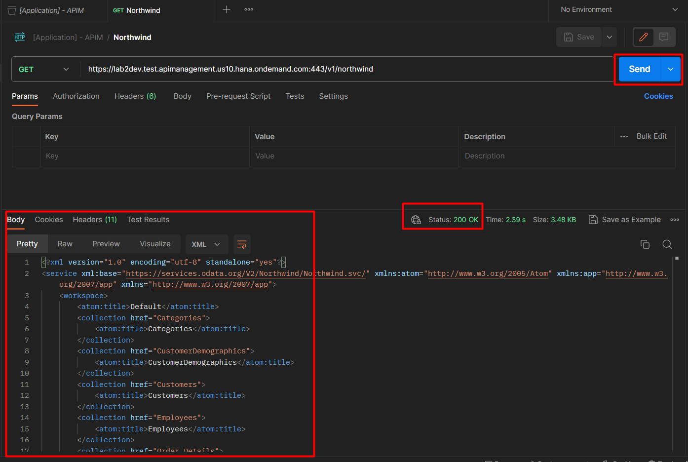

# Exercício 3 - Consumindo API via Postman

Neste exercício será demonstrado como utilizar a ferramenta postman para consumir e testar suas APIs desenvolvidas no SAP API Management.

### 3.1 - Iniciando o Postman

1. Acesse a página oficial do postman https://www.postman.com/downloads/ para criar uma conta e utlizar a ferramenta. Você poderá utilizar o serviço via Browser ou fazer o download e instalar em sua máquina.

### 3.2 - Criando uma collection para nossa API

1. Vamos criar uma collection para agrupar todas as chamadas referente a nossa API. Clique em "New".

2. Depois clique em "Collection".

3. De um nome sugestivo para a collection que irá conter as chamadas de sua API.

### 3.3 - Configurando a chamada de requisição para nossa API

1. Clique em "..." e depois em "Add request" para criar uma request dentro de nossa collection.

2. Clique onde está sublinhado em azul para renomear sua requisição. Nesse caso estou colocando o nome da nossa API.

3. Copie a **API Proxy URL** gerada na página da sua API no Integration Suite e cole essa URL no Postman.

4. Clique em "Send" para enviar uma requisição GET e aguarde o retorno no serviço. Como pode observar se tudo foi configurado corretamente esperamos um Status 200 OK e a API irá retornar os serviços disponíveis para serem consumidos do Northwind.

