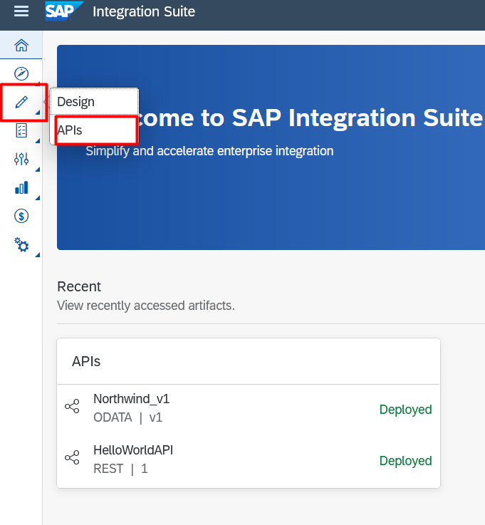
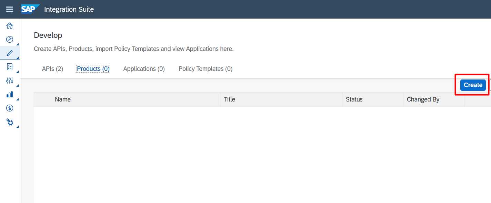
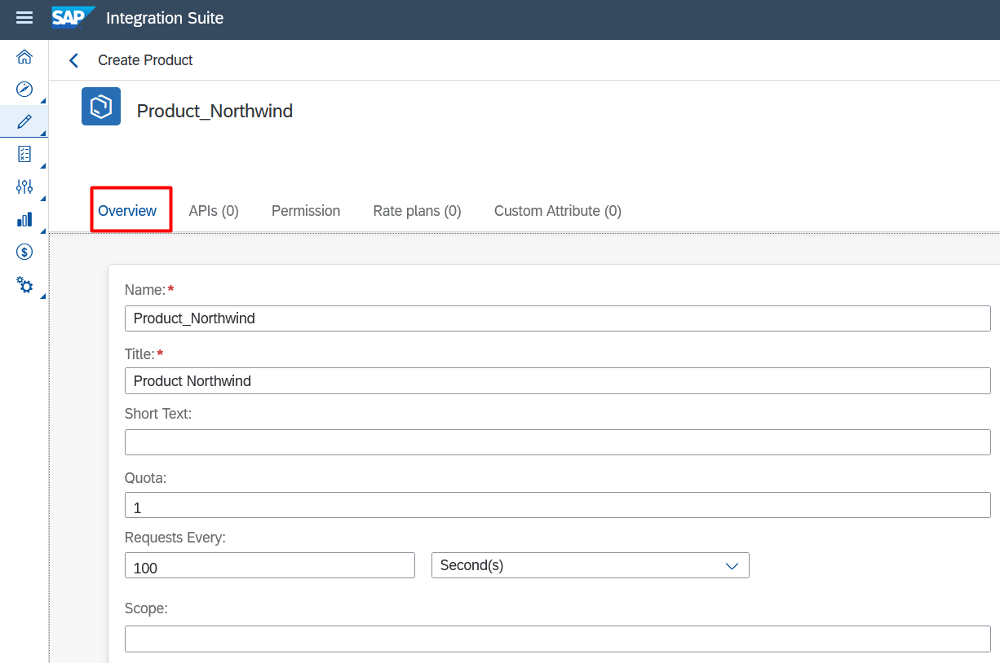
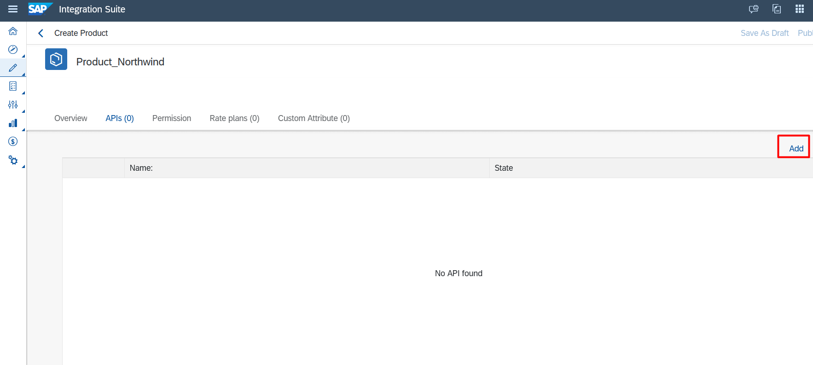
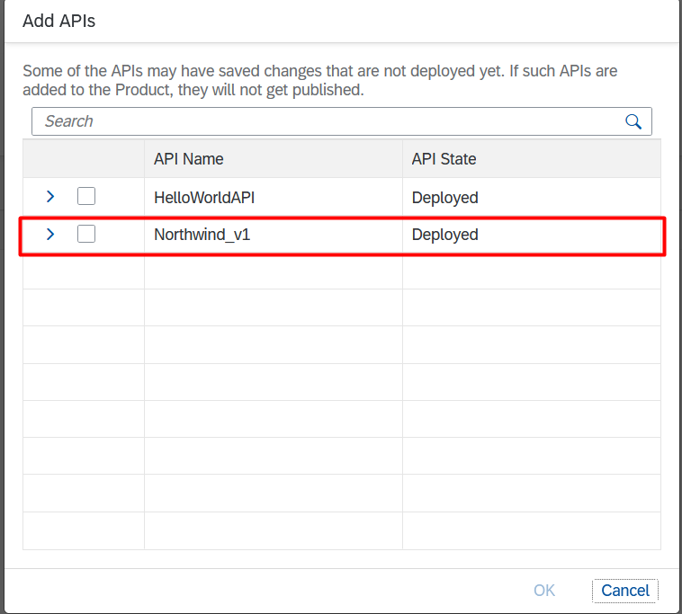
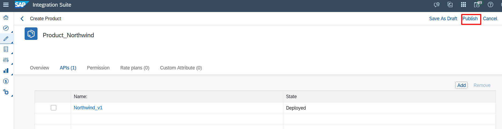

# Exercício 4 - Criando um Product

Neste exercício será demonstrado como criar e associar um product à sua API.

### 4.1 - Acessando aba de Prducts

1. Acesse a página de APIs em "Design Artifacts"

2. Clique na aba "Products"

### 4.2 Configurando Product

1. Clique em "Create"

2. Na aba "Overview" coloque um Nome, Título e Descrição para seu Product. A Quota definine o número de requisições que uma application pode enviar para a API em um período de tempo. O Período de tempo pode ser horas, dias e meses. Vamos colocar um valor genérico apenas para realizar nosso hands-on.

3. Na aba "APIs" clique em "Add"

4. Selecione a API Northwind_v1 criada para nosso teste.

5. Clique em "Publish" para salvar e publicar nossa API para ser consumida.

