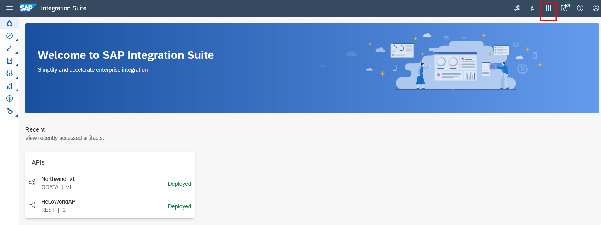
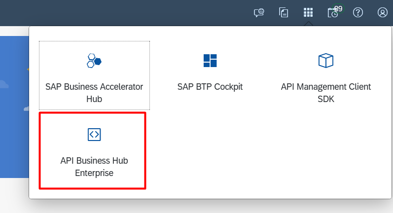
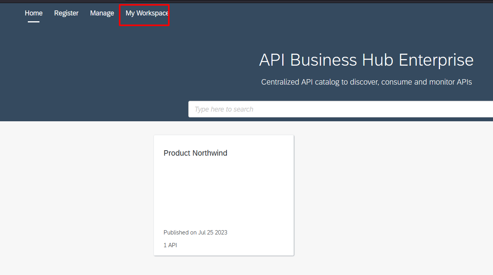
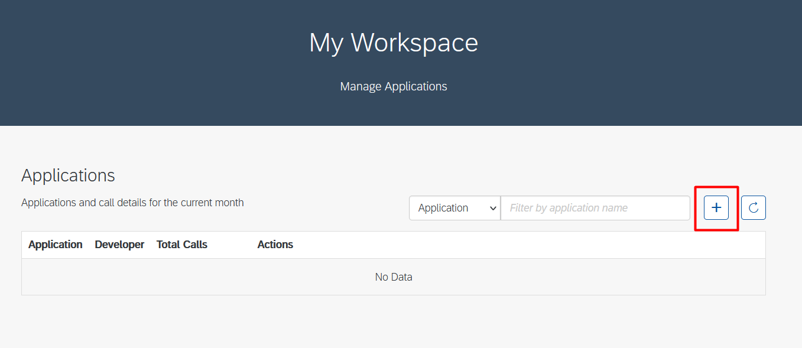
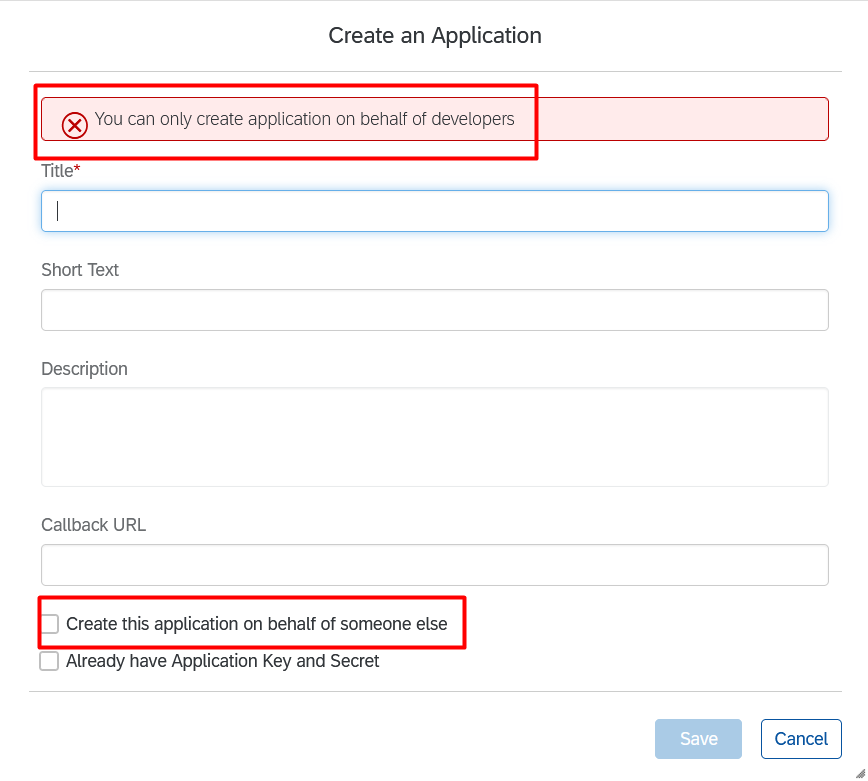
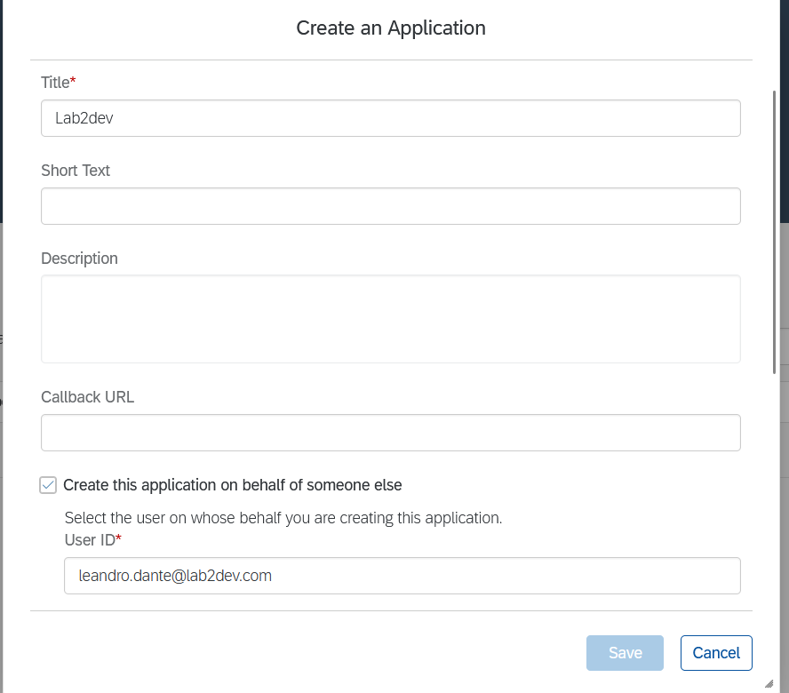
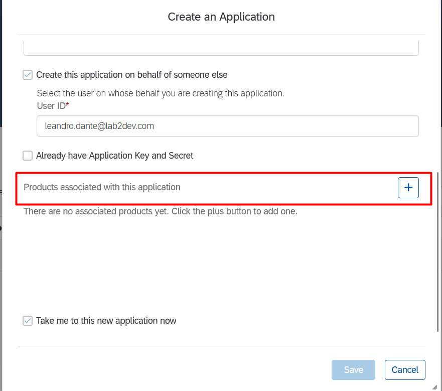
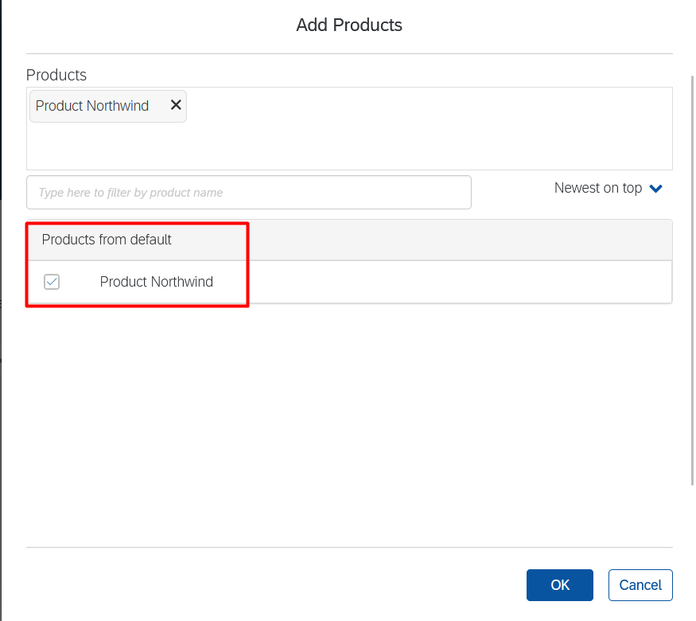
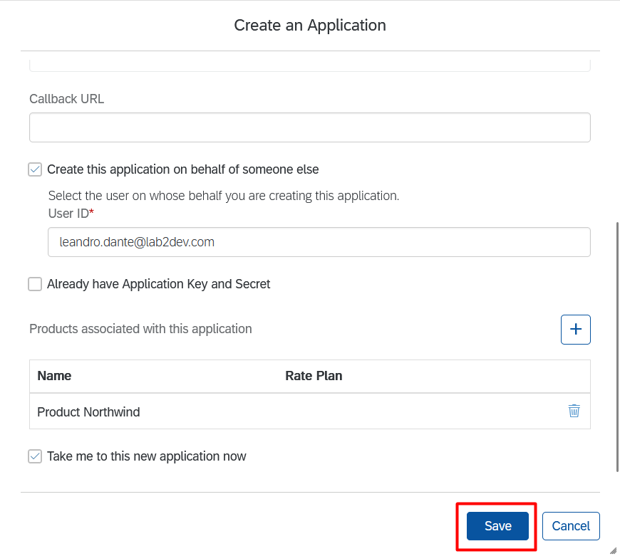
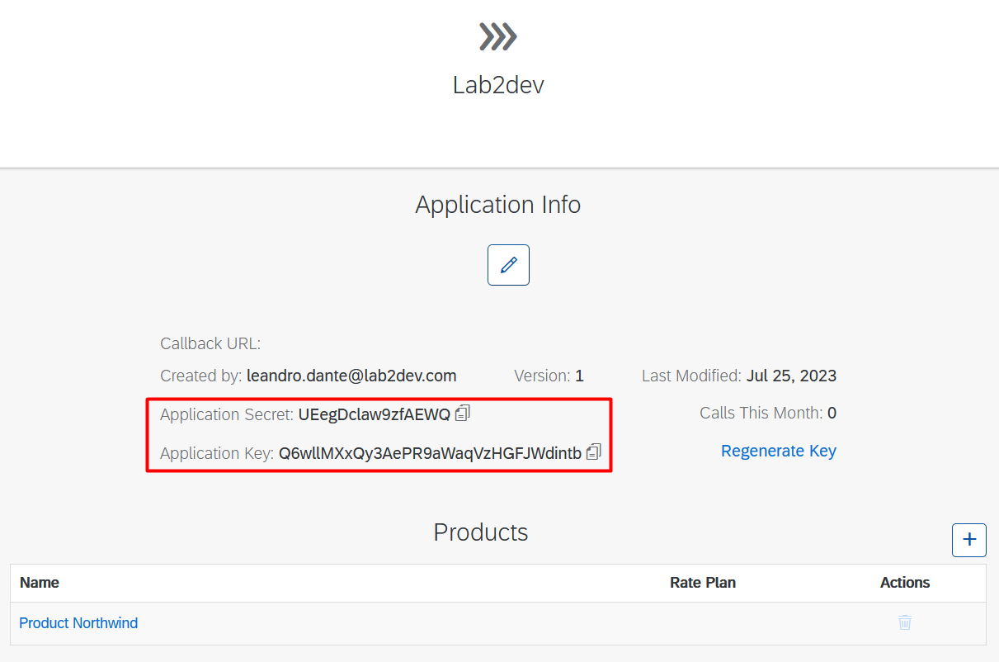

# Exercício 5 - Criando uma Application

Este exercícios tem o objetivo de realziar a criação de uma Application, vinculá-la ao Product criado e pegarmos a Application Secret e Application Key que serão utlizados como segurança para nossa API.

### 5.1 - Acessando API Business Hub

1. Para realizar a criação da Application precisamos acessar a página do API Business Hub. Clique em "Navigation Links" no canto superior direito.

2. Clique em "API Business Hub Enterprise"

3. Na página inicial do API Business Hub Enterprise vá para a aba "My workspace".

### 5.2 - Criando uma Application 

1. Esta página é onde será exibida todas as Applications criadas. Clique em "+" para criar uma Application nova.

2. A página mostra um warning falando só podemos criar uma application em nome de algum outro usuário com permissões. Basta selecionar a opção "Create this application on behalf of someone else". Para mais informações de uma olhada na documentação em https://help.sap.com/docs/sap-api-management/sap-api-management-for-neo-environment/create-product

3. Adicione o user ID de quem tem as roles necessárias.

4. Clique em "+" em "Products associated with this application" para associarmos essa application com nosso product criado no exercício anterior.

5. Selecione o Product criado. Clique em "OK".

6. Clique em "Save".

7. Copie a Application Secret e Application Key que serão utlizados nos próximos exercícios.

