# Exercício 6 - Criando Policies

Neste exercício iremos criar as policies para nossa API e vamos falar um pouco sobre elas.

### 6.1 - Acessar Plocies da API 

1. Acesse a página de APIs em "Design Artifacts"

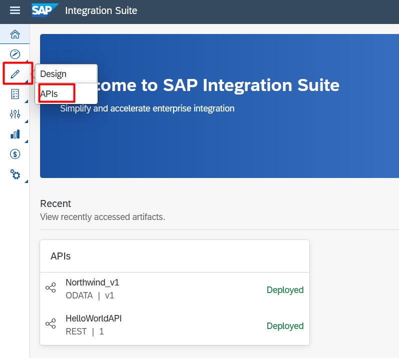

2. Selecione a API criada.

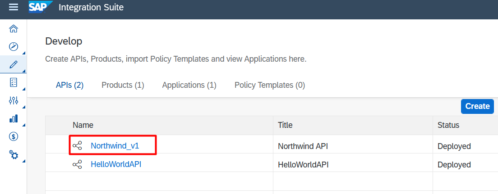

3. Clique em "Policices".

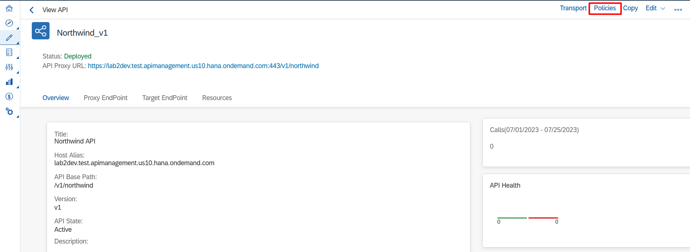

### 6.2 - Painel de policies

1. Área dos fluxos de nossa API. Um fluxo define um pipeline de processamento que controla como a API se comporta e define quais informações ela deve transportar.
- PreFlow: Este fluxo é sempre executado como primeiro passo no segmento onde é aplicado, antes do fluxo condicional.
- PostFlow: Este fluxo é executado sempre como último passo no segmento onde é aplicado, após o fluxo condicional.

2. Aqui irá mostrar todas as policies criadas.

3. Aqui irá mostrar todos os scripts criados.

4. Nessa parte irá mostrar todo o fluxo de nossa API com as Policies vinculadas.

5. Todas as Policies disponíveis para criação.

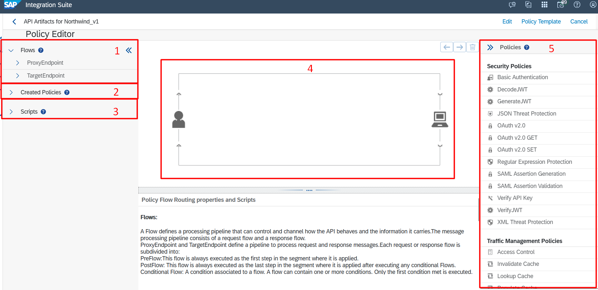

### 6.2 - Criando Novas Policies

1. Clique em "Edit". Vamos começar criando policies para nosso ProxyEndpoint Preflow.

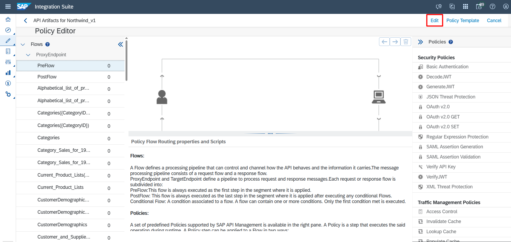

2. OAuth v2.0
- Depois que um endpoint de token é configurado para um proxy de API, essa policie faz a verificação e protege nossa API.

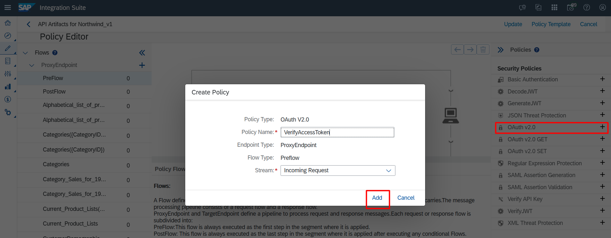

3. Verify API Key
- Um dos mecanismos para impedir o acesso não autorizado a APIs expostas na Internet é usar a política de verificação de chave de API.


4. Vamos alterar A Policie de Verify API Key para passarmos essa Key pelo header da chamada.
```
<VerifyAPIKey async='true' continueOnError='false' enabled='true' 
xmlns='http://www.sap.com/apimgmt'>
	<APIKey ref='request.header.APIKey'/>
</VerifyAPIKey>
```
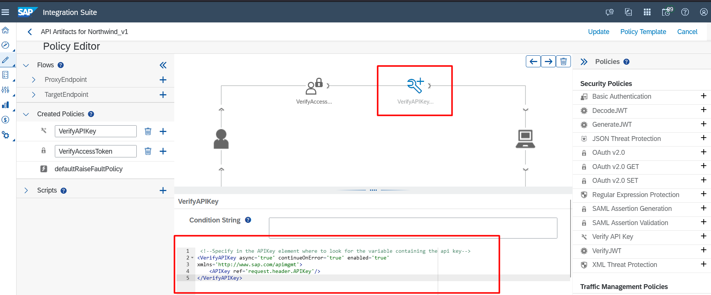

5. Access Control
- Restrinja o acesso às suas APIs com base em endereços específicos de "Internet Protocol" (IP).

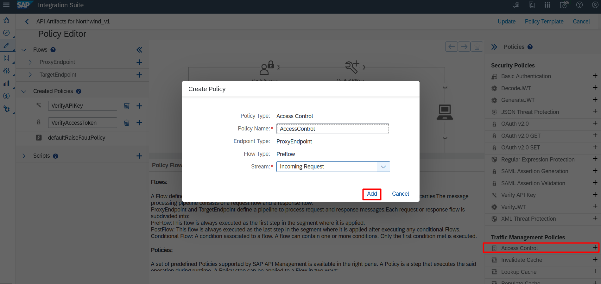

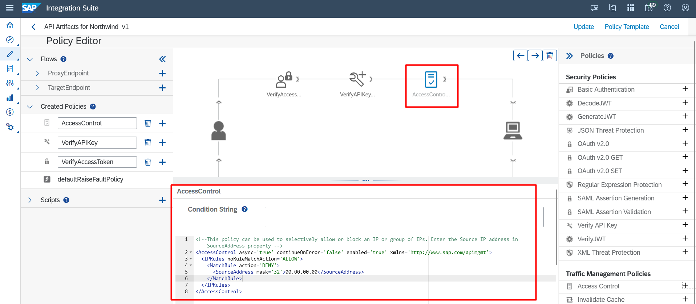

6. JSON Threat Protection
- Minimiza o risco representado por ataques em nível de conteúdo, permitindo limites específicos em várias estruturas JSON, como arrays e strings.

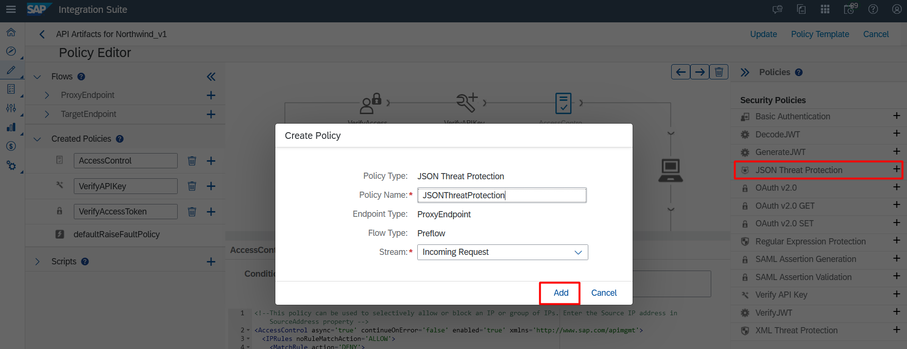

7. XML Threat Protection
- Permite que os desenvolvedores resolvam as vulnerabilidades do XML e minimizem os ataques à API. Além disso, ele permite que você detecte ataques de carga XML com base em limites configurados e faça a triagem contra ameaças XML

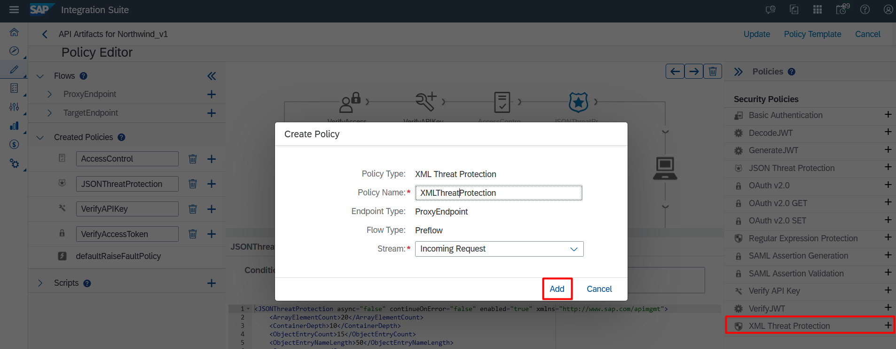

8. Quota
- A política de cota define o número de mensagens de solicitação que um aplicativo pode enviar para uma API durante um determinado período de tempo.
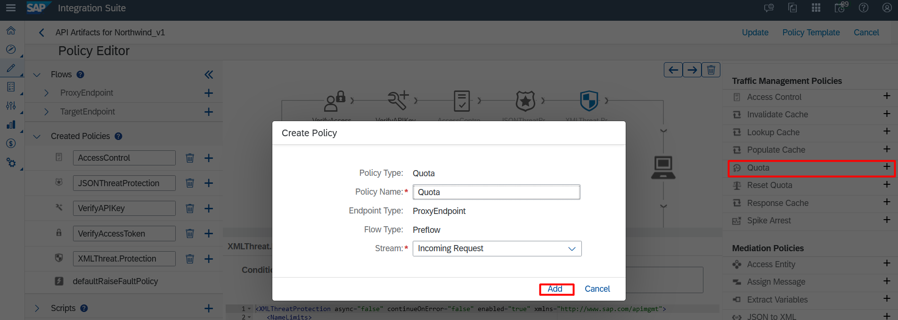

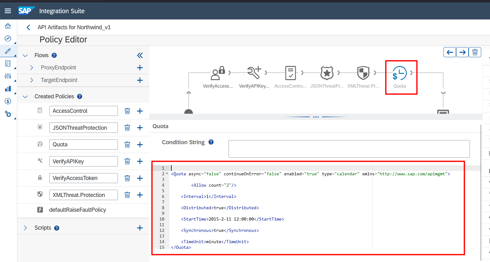

9. XML to JSON
- Policie para converter mensagens do formato de linguagem de marcação extensível (XML) para o formato de notação de objeto JavaScript (JSON).


10. Vamos adicionar essa Policie em nosso PostFlow apenas para fins de testes.

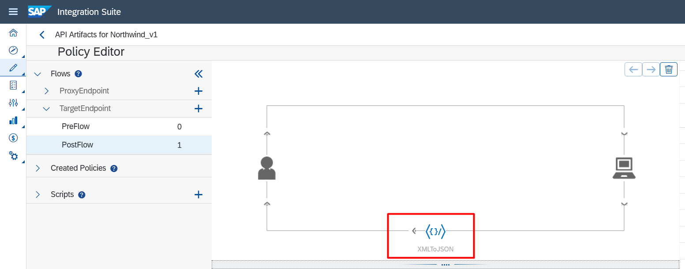

11. Clique em "Update"

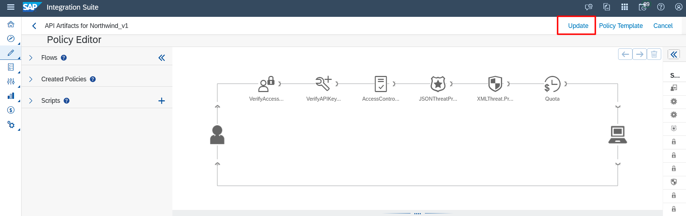

12. Salve as alterações

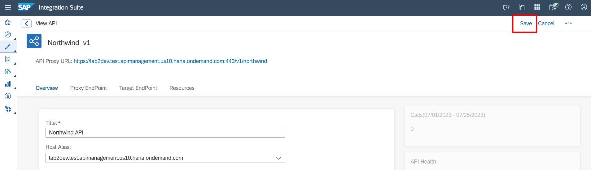

13. Faça o Deploy da API

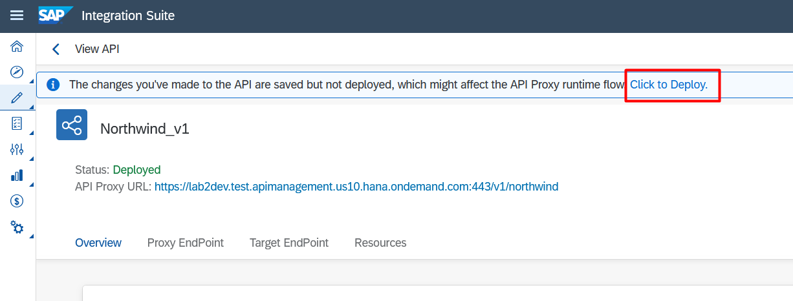

14. Veja se as alterações foram realizadas com sucesso.

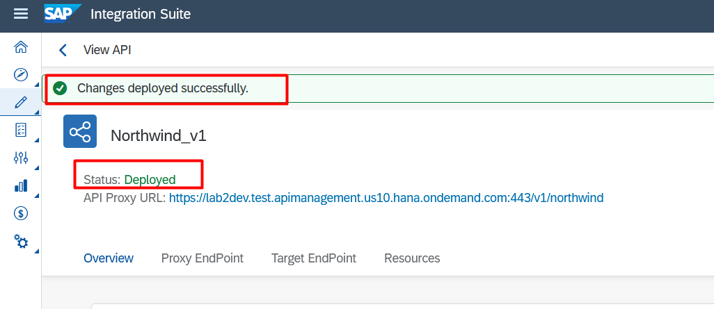

### 6.3 - Testando no Postman

1. Ao executar novamente nossa requisição do Postman podemos observar que as Policies já estão fazendo seu trabalho.

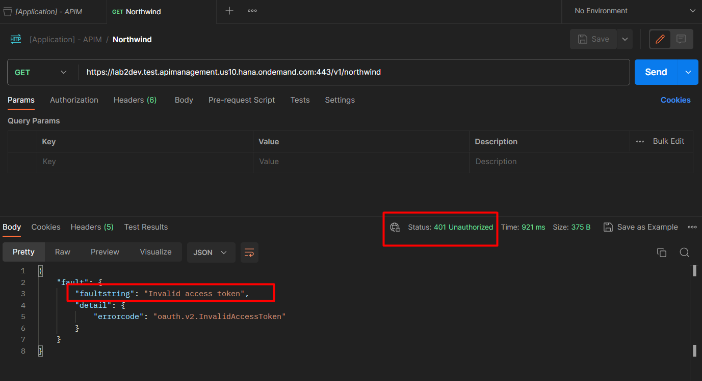
