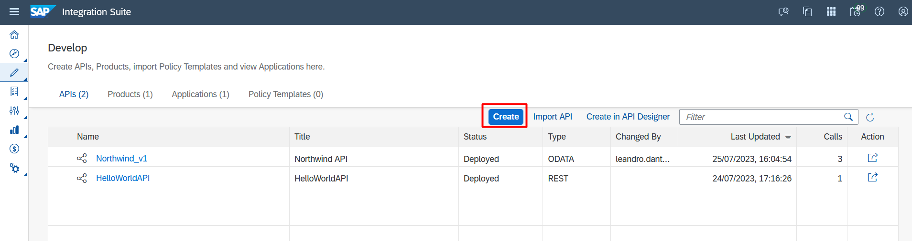
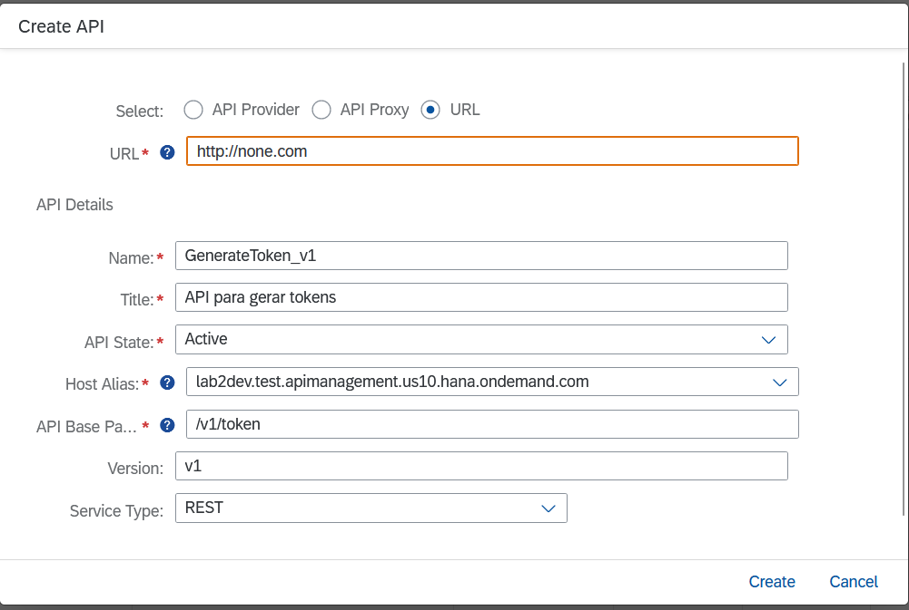
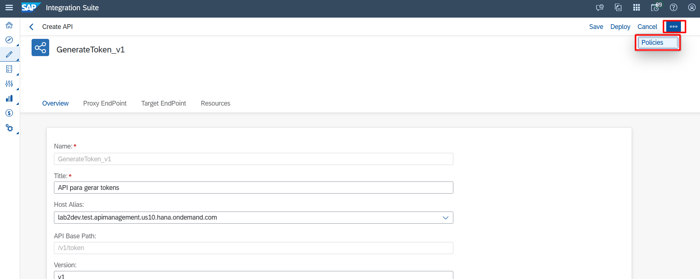
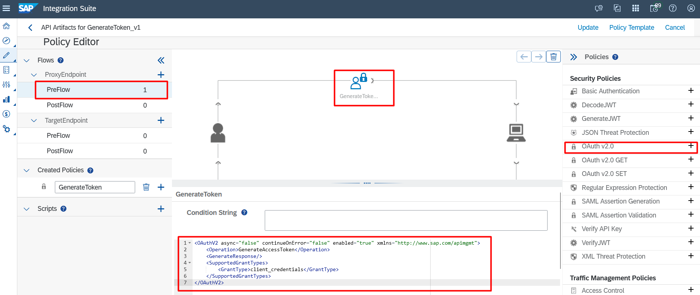
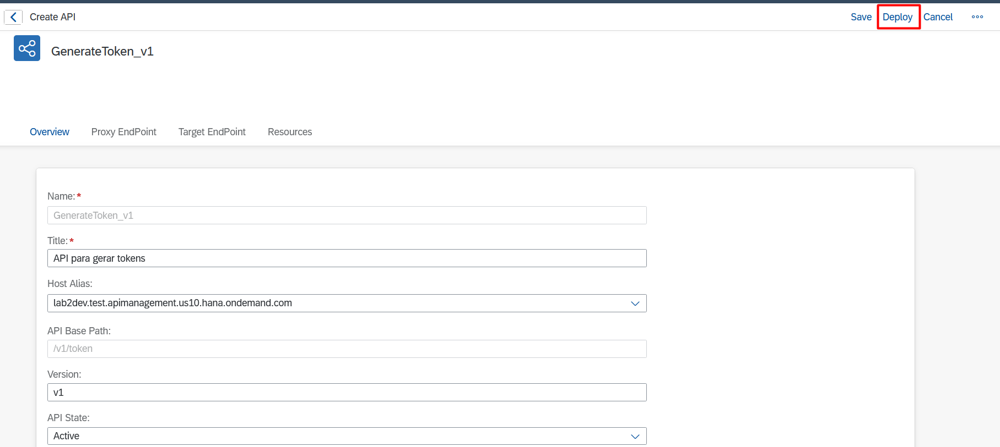
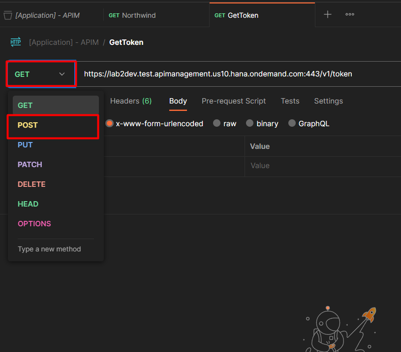
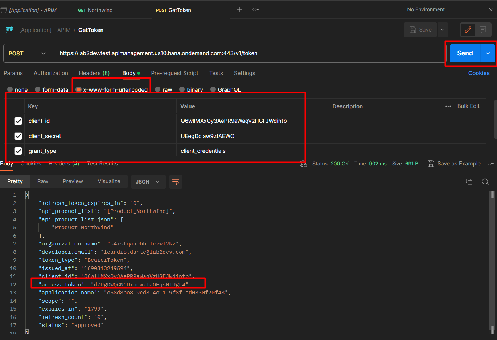
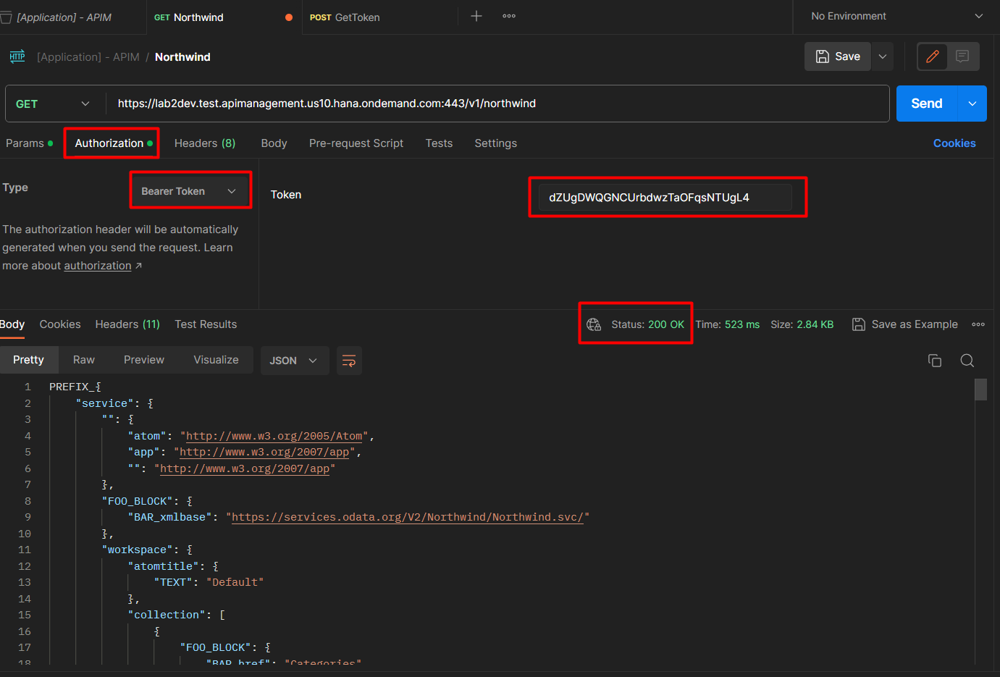

# Exercício 7 - Criando Gerador de Tokens

Neste exercício iremos criar um exemplo de API que vai gerar tokens para a segurança de nossa API

### 7.1 - Acessar área de API Proxy

1. Acesse a página de APIs em "Design Artifacts". Clique no botão "Create"



### 7.2 - Configurando a API

1. Vamos adicionar as configurações de nossa API para gerar Tokens.



**Informações:**

- **Select:** URL
- **URL:** http://none.com
- **Name:** GenerateToken_v1
- **Title:** API de Tokens
- **API State:** Active
- **API Base Path:** /v1/token
- **Version:** v1
- **Service Type:** REST
- Clique em "Create"

2. Vamos adionar a Policie de Token. Cleique em "..." e depois "Policies".



3. Clique em "Edit", Selecione o Preflow do nosso ProxyEndpoint, Clique em "+" na policie OAuth v2.0 e copie o código:

```<OAuthV2 async="false" continueOnError="false" enabled="true" xmlns="http://www.sap.com/apimgmt">
    <Operation>GenerateAccessToken</Operation>
    <GenerateResponse/>
    <SupportedGrantTypes>
        <GrantType>client_credentials</GrantType>
    </SupportedGrantTypes>
</OAuthV2>
```
 


5. Clique em "Deploy"



### 7.3 - Testando no Postman

1. Em nosso Postman vamos criar uma nova requisição para essa API. Copie a URL gerada, mude o método para POST.



2. No body clique na opção "x-www-form-urlencoded" e passe os campos:

- **client_id:** Application Key da application da API Northwind_v1
- **client_secret:** Application Secret da application da API Northwind_v1
- **grant_type:** client_credentials

Clique em "Send" para enviar a requisição.



3. Volte para a requisição da API Northwind_v1. Em authorization selecione a opção "Bearer Token" e cole o Token gerado pela API.

