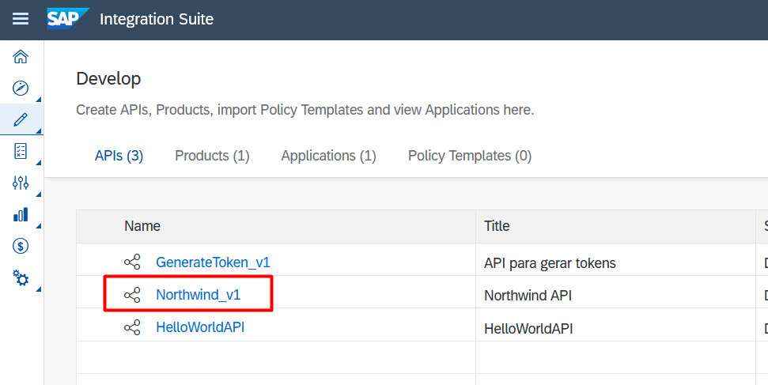
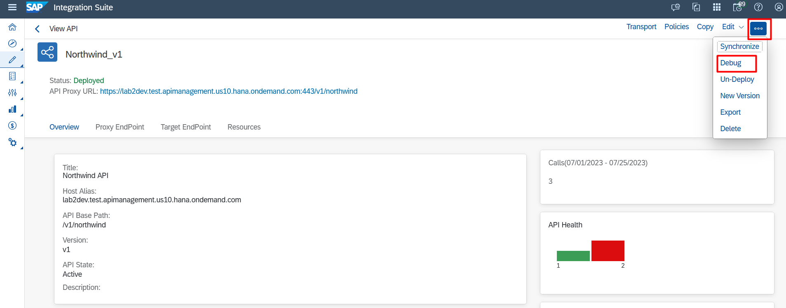
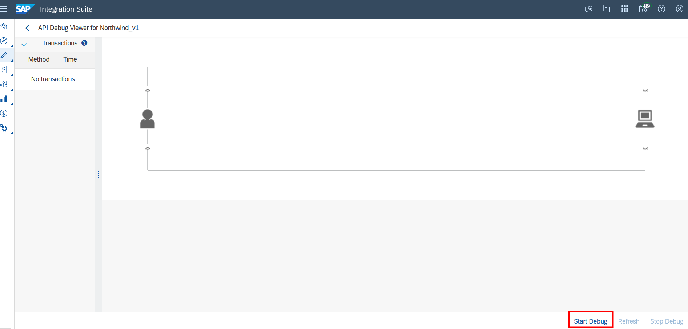
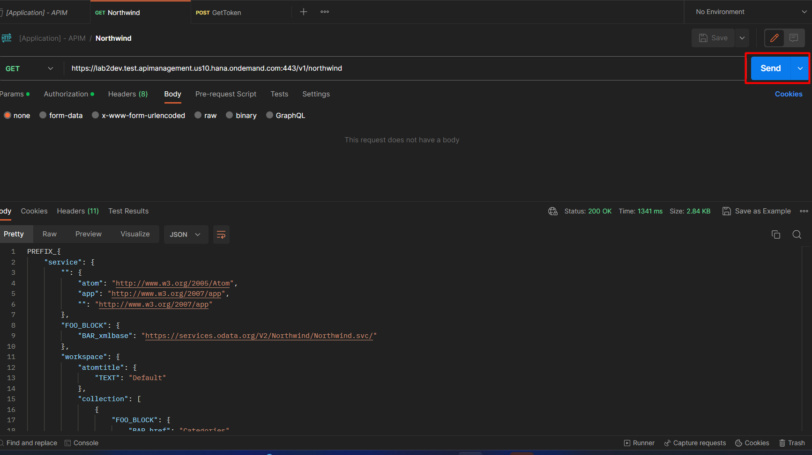
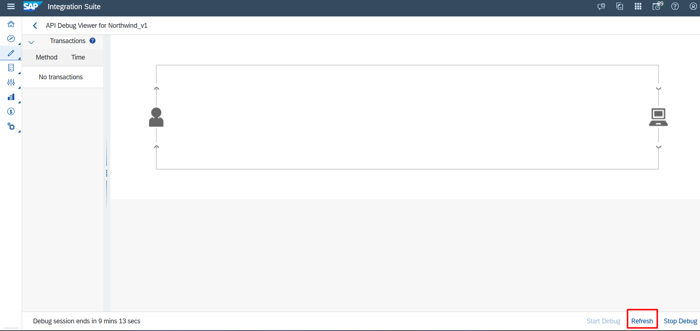
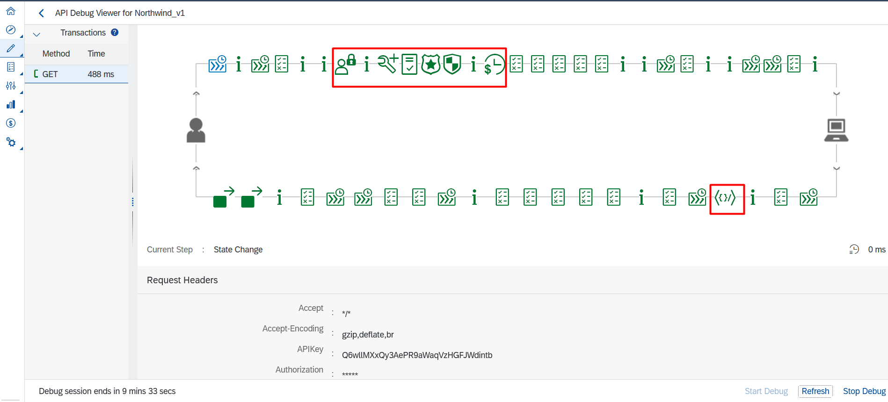

# Exercício 8 - Explorando o Debug

Neste exercício vamos explorar a ferramenta de Debug e mostrar como ela funciona.

### 8.1 - Acessar área de Debug

1. Acesse a página de APIs em "Design Artifacts" e abra a página da API criada.

2. Clique em "..." e depois em Debug.

3. Para iniciar o debug e o API Management começar a capturar as requisições é necessário darmos o "Start Debug" no canto inferior direito.

4. Voltamos para nossa chamada de requisição criada no Postman e mandamos uma requisição GET.

5. Na página de debug clicaremos em "Refresh" para atualizar as Transactions capturadas.

6. Será exibida todo o fluxo da requisição passando pelas nossas Policies configuradas. Dessa maneira podemos ver que todo o processo ocorreu como o esperado e podemos ver informações detalhadas de cada elemento no fluxo.

